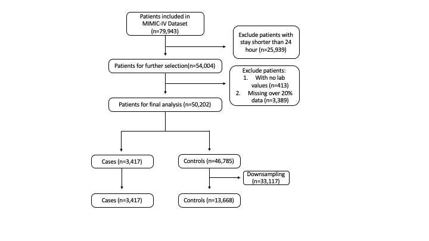

```{r setup, include=FALSE}
knitr::opts_chunk$set(echo = FALSE, message = FALSE, warning = FALSE)

```


```{r message=FALSE}
library(readr)
library(tidyverse)
library(caret)
library(dslabs)
library(vip)
library(randomForest)
library(mlr)
library(pROC)
library(tableone)
```

## Introduction:

|   As technology continues to develop and improve the field of medical research has been interested in using available medical records to understand more about disease and improve treatment outcomes. Considerable work has been done to make medical data available to researchers, including the work at MIT and Beth Israel Deaconess Medical Center (BIDMC) to release the MIMIC datasets [1,2]. The most recent release of the MIMIC data is MIMIC-IV. This release contains de-identified data from ICU and hospital patients that have been admitted to BIDC between the years of 2008 and 2019 (Fig. 1,2,3). The patient data includes physiologic data collected from monitoring, lab results, demographic data, and treatment/diagnosis data. While this data is de-identified to protect the privacy of the patients included in MIMIC-IV, additional steps are taken before an interested party can access the data. To access MIMIC-IV, one must take an online training course in patient data privacy laws and regulations as well as sign off on data use agreements before one is credentialed for MIMIC-IV access. 
|   Over the years, many papers have been published using the MIMIC data for clinical data science. Many of these papers include the generation and deployment of prediction models [3]. For this project I will be generating a mortality prediction model with a constrained version of the MIMIC data only involving patients from the ICU. When patients enter the ICU there is a wide range of severity in disease that patients experience. It is important for doctors and medical staff to quickly assess the severity and create a treatment plan tailored to that individual. While there are a couple simple scoring models that doctors can use they have relatively low accuracy for predicting future mortality.
|   This project will determine if there is a viable method for predicting mortality based on the laboratory vitals collected from patients within the first 24 hours in the ICU.There are around 40 laboratory tests that are collected in the MIMIC data including: lactate, hemoglobin, and platelet levels throughout the patient’s stay in the ICU (Table 1). This prediction model will give medical professionals insight into the severity of their patient’s disease based on their laboratory result. Additionally, two models will have their performance evaluated and compared, logistic regression and random forest. These models were selected as they have been commonly used models in the area of mortality prediction research [4]. The better performing model out of the two will be selected for the final prediction model. 

## Results

|   The MIMIC-IV dataset is a relational database composed of many tables that contain patient data collected from a variety of sources. It is recommended by the creators of MIMIC that the data is accessed through the cloud. For this project Google’s BigQuery was implemented to explore the contents of each table and to locate the laboratory test results as well as demographic patient information. Once credentialed for access using the physionet platform and linking google accounts SQL code was used to extract MIMIC data into a Google Colab notebook. Demographic and hospital stay information was extracted from the MIMIC-IV tables: mimiciv_hosp.admissions, mimiciv_icu.icustays, and mimiciv_hosp.patients. Lab results were extracted from mimiciv_hosp.labevents. Tables were merged on the shared columns: ‘subject_id’, ‘stay_id’, and ‘hadm_id’ (hospital admission ID). The combination of these three identifiers generate a unique patient stay in the ICU.
|   Once merged, the merged tables were then filtered to remove any subjects that were missing all demographic information or all laboratory values. Additionally, the subjects were removed from the study if they had more than 20% missing data across all included variables. This table was then exported as a csv file for further tidying using R. In order to reduce processing time and to improve the accuracy of the model the entire dataset was downsampled so the ratio of cases to controls was around 3:1 (controls: cases). In this study, cases include any subjects with the outcome of interest, mortality. The dataset was reduced from around 50,000 subjects to around 17,000 subjects. At this point the final dataset was generated and prepared for modeling and analysis (Fig. 4).  
|   For logistic regression and random forest model a training and testing datasets were generated with a 80/20 split. Logistic regression modeling was performed and tested with an accuracy of 0.74, indicating that the model was able to correctly identify patients that were at risk for mortality 74% of the time. The logistic regression model also reported a sensitivity or recall score of 0.76  and specificity of 0.71 showing 76% of the time mortality was predicted correctly and 71% of the time survival was predicted correctly (Table 2). Using the ‘vip’ package in r the variable importance was plotted for the logistic regression model [5]. The plot shows, ‘albumin_min’, ‘lactate_max’, ‘lactate_min’, and ‘sodium_max’ as the top predictive features of mortality for MIMIC-IV ICU patients (Fig. 5). Finally, the ROC-AUC curve was plotted for the logistic regression model and reported an AUC of 0.74. This value closely matches the accuracy of the model and provides additional evidence of the predictive qualities of the model (Fig. 7). 
|   The random forest model was then generated using the same train and test as a basis of the model. However, for the random forest model the variables were imputed for missing values using the median value of the feature. The model was then evaluated using the test set and reported an accuracy of 0.85. The random forest model predicted more mortality outcomes correctly compared with the logistic regression model. Aside from accuracy the random forest model has a sensitivity and 0.97 and specificity of 0.34 (Table 2). These values are not balanced with almost all cases of mortality correctly predicted and very few survival cases predicted correctly. Since  prevalence of 0.80 is reported, it can be explained that due to the relatively low proportion of survival according to prevalence, the low specificity (ability to predict survival) does not impact the overall accuracy. The top predictive features were plotted and include: ‘lactate_mean’, ‘lactate_min’, ‘lactate_max’, ‘phosphate_max’, and ‘sodium_max’ (Fig. 6). Lastly, the ROC-AUC curve was generated and found an AUC of 0.66. This decrease in performance in comparison with the accuracy is reflective of the low specificity of the model (Fig. 8). 

## Conclusion

|   The goal of this study was to report the predictive properties of laboratory results of MIMIC-IV patients in the ICU on the outcome of mortality. The features were evaluated using logistic regression and random forest modeling to determine the relative importance of each feature as well as the function of the mortality prediction model overall. While the logistic regression model did have a lower overall accuracy compared to the random forest, there was more even balance in the sensitivity and specificity metrics. In the case of mortality prediction in the ICU there is greater concern in a low sensitivity as that would indicate a low ability to predict mortality which has a greater consequence than low specificity, indicating reduced survival prediction. However, it is not ideal for a model to struggle with a key metric evaluating the overall performance. Therefore, the logistic regression model is a better overall, more reliable model for mortality prediction in the ICU. Future studies of the random forest model using this data could look to determine a more optimal ‘mtry’ value or number of nodes to include in the model and could potentially improve the model performance. 
|   Both models found that the lactate variable is highly predictive of mortality. As well as lactate, both models selected sodium as an important variable for predicting mortality. These results are in line with current medical understanding. Changes in lactate are often noted as the onset for changes in blood pressure and heart rate which are important indicators of health [6]. Lactate levels have also been reported to correlate with the diagnosis of septic shock in critically ill patients [7].  High sodium levels have also been reported to indicate renal function decline and dehydration which both are important for patient health [8,9]. The top predictive features selected  by both models are not surprising and give greater evidence that the predictive model is informative of patient health within the first 24 hours of lab results collected. 
|   In future work, more physiologic data could be added to the model to improve the accuracy of the prediction and to determine the relative importance of laboratory results in predicting mortality compared with other data, for example, vital signs and  comorbidities. As it is, the models provide insight into ICU patients and the predictive qualities of their laboratory results collected on the risk for mortality. The results of this report also indicate that logistic regression is an acceptable model for mortality prediction and should continue to be a metric in which we compare newer or more complex model’s performance. 

## References

1. Goldberger, A., Amaral, L., Glass, L., Hausdorff, J., Ivanov, P. C., Mark, R., ... & Stanley, H. E. (2000). PhysioBank, PhysioToolkit, and PhysioNet: Components of a new research resource for complex physiologic signals. Circulation [Online]. 101 (23), pp. E215–e220.
2. Johnson, A., Bulgarelli, L., Pollard, T., Horng, S., Celi, L. A., & Mark, R. (2022). MIMIC-IV (version 2.1). PhysioNet. https://doi.org/10.13026/rrgf-xw32.
3. Pang K, Li L, Ouyang W, Liu X, Tang Y. Establishment of ICU Mortality Risk Prediction Models with Machine Learning Algorithm Using MIMIC-IV Database. Diagnostics. 2022; 12(5):1068. https://doi.org/10.3390/diagnostics12051068
4. Naemi A, Schmidt T, Mansourvar M, et alMachine learning techniques for mortality prediction in emergency departments: a systematic reviewBMJ Open 2021;11:e052663. doi: 10.1136/bmjopen-2021-052663
5. Brandon M. Greenwell and Bradley C. Boehmke (2020). Variable Importance Plots—An Introduction to the vip Package. The R Journal, 12(1), 343--366. URL https://doi.org/10.32614/RJ-2020-013.
6. Okorie ON, Dellinger P. Lactate: biomarker and potential therapeutic target. Crit Care Clin. 2011 Apr;27(2):299-326. doi: 10.1016/j.ccc.2010.12.013. PMID: 21440203.
7. Dong Hyun Oh, Moo Hyun Kim, Woo Yong Jeong, Yong Chan Kim, Eun Jin Kim, Je Eun Song, In Young Jung, Su Jin Jeong, Nam Su Ku, Jun Yong Choi, Young Goo Song, June Myung Kim, Risk factors for mortality in patients with low lactate level and septic shock, Journal of Microbiology, Immunology and Infection, Volume 52, Issue 3, 2019,Pages 418-425, https://doi.org/10.1016/j.jmii.2017.08.009.
8. Braun MM, Barstow CH, Pyzocha NJ. Diagnosis and management of sodium disorders: hyponatremia and hypernatremia. Am Fam Physician. 2015 Mar 1;91(5):299-307. PMID: 25822386.
9. Cook NR, He FJ, MacGregor GA, Graudal N. Sodium and health-concordance and controversy. BMJ. 2020 Jun 26;369:m2440. doi: 10.1136/bmj.m2440. Erratum in: BMJ. 2020 Jun 29;369:m2608. He, J [corrected to He, Feng J]. PMID: 32591335; PMCID: PMC7318881.

## Appendix

```{r message=FALSE}
# Load ICU data from MIMIC-IV
ICU_df <- read_csv("ICU_df.csv")
```

```{r}
# define the control and case subjects
control <- ICU_df %>% filter(mort_icu == 0)
case <-  ICU_df %>% filter(mort_icu == 1)

#downsample dataset
control <- sample_n(control, 13668)
ICU_df <-rbind(control,case) 
```

```{r gender pie, message=FALSE, out.width="50%", fig.cap="Percentage of each gender incldued in the MIMIC-IV derived data"}
# Generate pie chart of proportion of genders included in data
ICU_df |>
  group_by(gender) |>
  count() |>
  ggplot(aes(x = "", y = n, fill = gender)) + 
  geom_col() + 
  coord_polar(theta ="y") +
  theme(axis.text = element_blank(),
        axis.ticks = element_blank(),
        axis.title = element_blank(),
        panel.grid = element_blank(),
        panel.background = element_rect(fill = "#ebf2ff"),
        plot.background = element_rect(fill = "#ebf2ff"),
        legend.background = element_rect(fill = "#ebf2ff"))

```

```{r age pie, echo=FALSE, message=FALSE, out.width="50%", fig.cap="Percentage of each age group incldued in the MIMIC-IV derived data"}
ICU_age <- ICU_df |>
  mutate(age_group = cut(ICU_df$admission_age, c(18, 29, 39, 49, 59, 69, 79, 90, Inf), c("18-29","30-39","40-49","50-59","60-69", "70-79", "80-90", ">90"), include.lowest=TRUE))

ICU_age |>
  group_by(age_group) |>
  count() |>
  ggplot(aes(x = "", y = n, fill = age_group)) + 
  geom_col() + 
  coord_polar(theta ="y") +
  theme(axis.text = element_blank(),
        axis.ticks = element_blank(),
        axis.title = element_blank(),
        panel.grid = element_blank(),
        panel.background = element_rect(fill = "#ebf2ff"),
        plot.background = element_rect(fill = "#ebf2ff"),
        legend.background = element_rect(fill = "#ebf2ff"))
```

\newpage
```{r race pie, echo=FALSE, out.width="80%"}
demo_pie <- ICU_df |>
  group_by(race) |>
  count() |>
  ggplot(aes(x = "", y=n, fill = race)) +
  geom_col() + 
  coord_polar(theta ="y") +
  theme(axis.text = element_blank(),
        axis.ticks = element_blank(),
        axis.title = element_blank(),
        panel.grid = element_blank(),
        panel.background = element_rect(fill = "#ebf2ff"),
        plot.background = element_rect(fill = "#ebf2ff"),
        legend.background = element_rect(fill = "#ebf2ff"),
        legend.position = "bottom",
        legend.text = element_text(size=5),
        legend.key.size = unit(0.2, "cm"))
```

```{r fig.cap="Percentage of each ethnicity incldued in the MIMIC-IV derived data"}
demo_pie
```

\newpage
```{r flowchart, echo=FALSE, fig.cap="flowchart of study population selection from MIMIC-IV",}

```

```{r tableone, message=FALSE, fig.cap="Table One of MIMIC-IV derived data"}
myVars <- c("admission_age", "gender", "los_icu", "aniongap_min", "aniongap_max", "albumin_min", "bicarbonate_min", "bicarbonate_max", "bilirubin_min", "bilirubin_max", "creatinine_min", "creatinine_max", "chloride_min", "chloride_max", "hematocrit_min", "hematocrit_max", "hemoglobin_min", "hemoglobin_max", "lactate_min", "lactate_max", "lactate_mean", "magnesium_min", "magnesium_max", "phosphate_min", "phosphate_max", "platelet_min", "platelet_max", "potassium_min", "potassium_max", "ptt_min", "ptt_max", "inr_min", "inr_max", "pt_min", "pt_max", "sodium_min", "sodium_max", "bun_min", "bun_max", "bun_mean", "wbc_min", "wbc_max", "wbc_mean")

carVars <- c("gender")

table <- CreateTableOne(vars= myVars, data = ICU_df, factorVars = carVars, strata = "mort_icu")
table1 <- print(table, noSpaces=TRUE, printToggle = FALSE)
#write.csv(table1, file = "TableOne.csv")
```

\newpage
```{r TableOne, message = FALSE}
TableOne <- read_csv("TableOne.csv")
knitr::kable(as.data.frame(TableOne|>select(-p, - test)|>rename(" " = "...1")),
      col.names = c("Feature", "Survival", "Mortality"),
      caption = "Overview of MIMIC-IV data")
```

\newpage
```{r message=FALSE, warning=FALSE, fig.cap = "Joined table from MIMIC-IV SQL tables"}
Joined_SQL <- read_csv("df_labs.csv")
print(Joined_SQL)
```

\newpage
```{r message=FALSE, warning=FALSE, fig.cap = "Final working dataframe for analysis"}
print(as.tibble(ICU_df))
```


```{r}
set.seed(2007)
y <- ICU_df$mort_icu
test_index <- createDataPartition(y, times = 1, p = 0.2, list = FALSE)
test_set <- ICU_df[test_index,]
train_set <- ICU_df[-test_index,]
```

```{r}
# Define model predictors 'x' and outcomes 'y'
y_train <- as.factor(train_set$mort_icu)
y_test <- as.factor(test_set$mort_icu)

x <- ICU_df |> 
  select(aniongap_min, aniongap_max, albumin_min, bicarbonate_min, bicarbonate_max, bilirubin_min, bilirubin_max, creatinine_min, creatinine_max, chloride_min, chloride_max, hematocrit_min, hematocrit_max, hemoglobin_min, hemoglobin_max, lactate_min, lactate_max, lactate_mean, magnesium_min, magnesium_max, phosphate_min, phosphate_max, platelet_min, platelet_max, potassium_min, potassium_max, ptt_min, ptt_max, inr_min, inr_max, pt_min, pt_max, sodium_min, sodium_max, bun_min, bun_max, bun_mean, wbc_min, wbc_max, wbc_mean)
  
x_train <- train_set |>
  select(aniongap_min, aniongap_max, albumin_min, bicarbonate_min, bicarbonate_max, bilirubin_min, bilirubin_max, creatinine_min, creatinine_max, chloride_min, chloride_max, hematocrit_min, hematocrit_max, hemoglobin_min, hemoglobin_max, lactate_min, lactate_max, lactate_mean, magnesium_min, magnesium_max, phosphate_min, phosphate_max, platelet_min, platelet_max, potassium_min, potassium_max, ptt_min, ptt_max, inr_min, inr_max, pt_min, pt_max, sodium_min, sodium_max, bun_min, bun_max, bun_mean, wbc_min, wbc_max, wbc_mean)
x_train_impute <- impute(x_train, classes = list(numeric = imputeMedian()))

x_test <- test_set |>
  select(aniongap_min, aniongap_max, albumin_min, bicarbonate_min, bicarbonate_max, bilirubin_min, bilirubin_max, creatinine_min, creatinine_max, chloride_min, chloride_max, hematocrit_min, hematocrit_max, hemoglobin_min, hemoglobin_max, lactate_min, lactate_max, lactate_mean, magnesium_min, magnesium_max, phosphate_min, phosphate_max, platelet_min, platelet_max, potassium_min, potassium_max, ptt_min, ptt_max, inr_min, inr_max, pt_min, pt_max, sodium_min, sodium_max, bun_min, bun_max, bun_mean, wbc_min, wbc_max, wbc_mean)
x_test_impute <- impute(x_test, classes = list(numeric = imputeMedian()))
```

```{r}
# Generate logistic regression model
glm_fit <- glm(mort_icu ~ aniongap_min + aniongap_max + albumin_min + bicarbonate_min + bicarbonate_max + bilirubin_min + bilirubin_max + creatinine_min + creatinine_max + chloride_min + chloride_max + hematocrit_min + hematocrit_max + hemoglobin_min + hemoglobin_max + lactate_min + lactate_max + lactate_mean + magnesium_min + magnesium_max + phosphate_min + phosphate_max + platelet_min + platelet_max + potassium_min + potassium_max + ptt_min + ptt_max + inr_min + inr_max + pt_min + pt_max + sodium_min + sodium_max + bun_min + bun_max + bun_mean + wbc_min + wbc_max + wbc_mean,
                      data = train_set,
                      family = "binomial")
```

```{r}
# Generate random forest mmodel
control <- trainControl(method="cv", number=5)
grid <- data.frame(mtry = c(1, 5, 10, 25, 30, 35, 40))
train_rf <- caret::train(x_train_impute$data, y_train,
                  method = "rf",
                  ntree = 150,
                  trControl = control,
                  tuneGrid = grid,
                  nSamp = 5000)

fit_rf <- randomForest(x_train_impute$data, y_train, mtry=train_rf$bestTune$mtry)
```

\newpage
```{r}
# Evaluate both models using confusion matrix
p_hat_logit <- predict(glm_fit, test_set, type = "response")
y_hat_logit <- factor(ifelse(p_hat_logit > 0.5, 1, 0))

cm_log <- confusionMatrix(as.factor(test_set$mort_icu), y_hat_logit)
log_Accuracy <- cm_log$overall[["Accuracy"]]
log_Sensitivity<- cm_log$byClass["Sensitivity"]
log_Specificity <- cm_log$byClass["Specificity"]
log_Prevalence <- cm_log$byClass["Prevalence"]

y_hat_rf <- predict(fit_rf, x_test_impute$data)

cm_rf <- confusionMatrix(y_hat_rf, y_test)
rf_Accuracy <- cm_rf$overall[["Accuracy"]]
rf_Sensitivity<- cm_rf$byClass["Sensitivity"]
rf_Specificity <- cm_rf$byClass["Specificity"]
rf_Prevalence <- cm_rf$byClass["Prevalence"]

Model <- c("Random Forest", "Logistic Regression")
Accuracy <- c(rf_Accuracy, log_Accuracy)
Sensitivity <- c(rf_Sensitivity, log_Sensitivity)
Specificity <- c(rf_Specificity, log_Specificity)
Prevalence <- c(rf_Prevalence, log_Prevalence)
df <- data.frame(Model, Accuracy, Sensitivity, Specificity, Prevalence)
knitr::kable(df,
      col.names = c("Model", "Accuracy", "Sensitivity", "Specificity", "Prevalence"),
      caption = "Evalutation Metrics for Predictive Models")
```

\newpage
```{r fig.cap="Top predictive features selected by the logsitic regression model"}
# Plot variable importance of logisitic regression model
vip(glm_fit)
```

\newpage
```{r fig.cap = "Top predictive features selected by the random forest model"}
# Plot variable importance of random forest model
vip(fit_rf)
```

\newpage
```{r fig.cap = "ROC-AUC Curve for logisitic regression model"}
# Plot ROC-AUC Curve for logisitc regression model
test_roc = roc(test_set$mort_icu ~ p_hat_logit, plot = TRUE, print.auc = TRUE)
```

\newpage
```{r fig.cap = "ROC-AUC Curve for random forest model"}
# Plot ROC-AUC Curve for random forest model
y_hat_rf_prob <- predict(fit_rf, x_test_impute$data, type = "response")
test_roc = roc(y_test ~ as.numeric(y_hat_rf_prob), plot = TRUE, print.auc = TRUE)
```

```{r ref.label=knitr::all_labels(), echo=TRUE, eval=FALSE}
```


